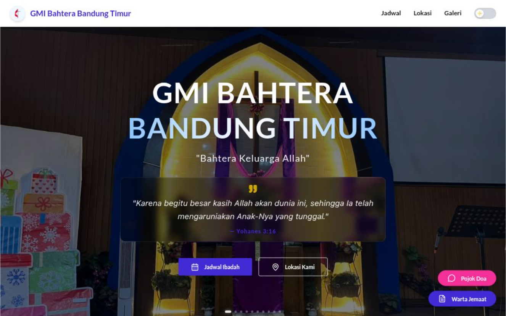

# ⛪ Integrated Information System for GMI Bahtera Bandung Timur



<div align="center">

[](https://nextjs.org/)
[](https://tailwindcss.com/)
[](https://vercel.com/)

**Student Creativity Program - Community Service (PKM-PM) 2025**
*Digitalization of Church Services to Enhance Efficiency & Information Accessibility for the Congregation*

[View Live Demo 🚀](https://gmi-bahtera-bandung-timur.vercel.app/)
</div>

---

## 📑 Table of Contents
- [Background](#-background)
- [Solutions & Key Features](#-solutions--key-features)
- [Technology Stack](#-technology-stack)
- [Installation](#-installation--usage)
- [Project Structure](#-project-structure)
- [Development Team](#-development-team)

---

## 💡 Background
In the era of digital transformation, fast and accurate access to information has become a fundamental necessity, including within religious institutions. **GMI Bahtera Bandung Timur** previously faced challenges in disseminating worship schedules, church bulletins, and activity documentation, relying heavily on conventional methods (oral announcements/printed paper), which were often ineffective in reaching the entire congregation.

This project serves as an **appropriate technological solution** to bridge this information gap through a responsive, user-friendly website platform designed to be inclusive for users of all age groups.

---

## 🚀 Solutions & Key Features

The website was developed using a **Human-Centered Design** approach, focusing on ease of use for both elderly and young congregants.

### 1. Real-time Worship Information
- Displays up-to-date weekly worship schedules.
- **Google Maps** integration for direct navigation to the church location and Class Meetings (CM).

### 2. Digital Congregation Services
- **Prayer Corner:** An interactive feature connecting congregants directly with the prayer team/pastor via WhatsApp.
- **Digital Bulletin:** Access to download the church bulletin (PDF) anytime and anywhere.

### 3. Documentation & Education
- **Activity Gallery:** Visual documentation of church activities featuring smart filters and search functionality.
- **Educational Profile:** Comprehensive information regarding the Methodist PAUD & TK (Kindergarten).

### 4. Modern User Experience (UX)
- **Responsive Design:** Optimized display for Smartphones, Tablets, and Desktops.
- **Micro-Interactions:** Smooth animations (AOS & Hover effects) for a pleasant user experience.
- **Content Security:** Content protection (Anti-copy/paste) to maintain the integrity of church data.

---

## 🛠 Technology Stack

This application is built using a *Modern Web Stack* to ensure high performance, excellent SEO, and maintainability.

| Category | Technology | Purpose |
| :--- | :--- | :--- |
| **Framework** | **Next.js 14 (App Router)** | Main React framework for fast rendering & SEO. |
| **Styling** | **Tailwind CSS** | Utility-first CSS framework for custom design. |
| **UI Component** | **DaisyUI** | Modern UI components (Buttons, Cards, Modals). |
| **Icons** | **Lucide React** | Lightweight and consistent vector icons. |
| **Animation** | **AOS (Animate On Scroll)** | Element animations upon scrolling. |
| **Deployment** | **Vercel** | Hosting with automated CI/CD. |

---

## 💻 Installation & Usage

Follow these steps to run the project on your local machine:

### Prerequisites
- Node.js (Version 18 or newer)
- Git

### Steps

1. **Clone Repository**
   ```bash
   git clone https://github.com/BerilBerekhyaa/GMI-Bahtera-Bandung-Timur-PKM-PM.git

2. **Navigate to Directory**
   ```bash
   cd GMI-Bahtera-Bandung-Timur-PKM-PM

3. **Install Dependencies**
   ```bash
   npm install

4. **Run Development Server**
   ```bash
   npm run dev

5. **Open Browser Access http://localhost:3000 to view the website.**

## 👥 Development Team
This project was developed and managed by:

Beril Berekhya Lead Developer, UI/UX Designer, Concept & Materials
<div align="center">


<small>Developed with love for the Glory of God.</small>


<small>© 2025 GMI Bahtera Bandung Timur. All Rights Reserved.</small> </div>
